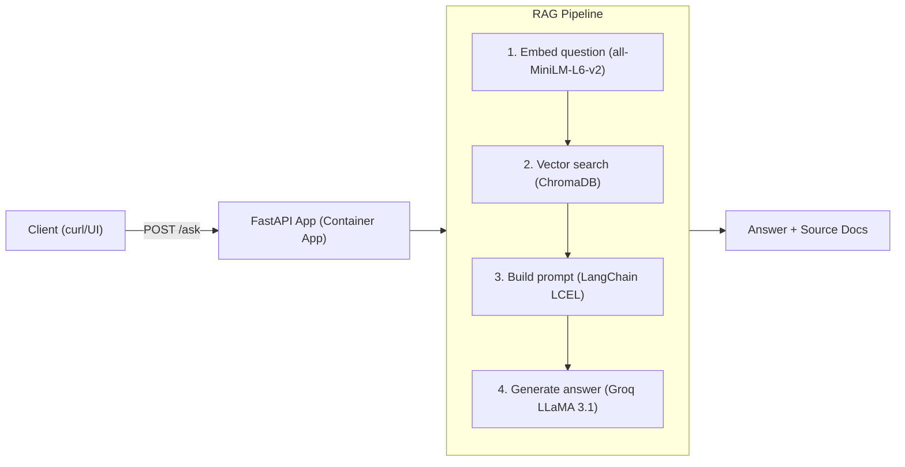
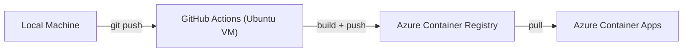

# RAG API

A production-grade Retrieval Augmented Generation API built with LangChain, ChromaDB, and FastAPI. Deployed on Azure Container Apps with automated CI/CD via GitHub Actions.

## Live Demo

| | |
|---|---|
| **Base URL** | https://rag-api.happyforest-2eae1650.eastus.azurecontainerapps.io |
| **Swagger UI** | https://rag-api.happyforest-2eae1650.eastus.azurecontainerapps.io/docs |
| **Health Check** | https://rag-api.happyforest-2eae1650.eastus.azurecontainerapps.io/health |

## Architecture

### RAG Pipeline



### CI/CD Pipeline



## Tech Stack

| Layer | Technology |
|---|---|
| API Framework | FastAPI — async REST, auto Swagger UI |
| RAG Orchestration | LangChain LCEL — retriever + LLM chain |
| Vector Store | ChromaDB — persistent local embeddings |
| Embedding Model | sentence-transformers/all-MiniLM-L6-v2 |
| LLM | Groq — llama-3.1-8b-instant |
| Containerisation | Docker — python:3.11-slim, non-root user |
| Image Registry | Azure Container Registry (Basic tier) |
| Deployment | Azure Container Apps — serverless, 1 replica |
| CI/CD | GitHub Actions — auto deploy on push to main |

## API Endpoints

| Method | Path | Rate Limit | Description |
|---|---|---|---|
| GET | `/health` | 60/min | Service status and document count |
| POST | `/ask` | 10/min | Ask a question, get grounded answer with sources |
| POST | `/chat` | 20/min | Conversational RAG with session memory |
| GET | `/documents` | 30/min | List documents with pagination |
| GET | `/cache/stats` | 5/min | Redis cache statistics |
| DELETE | `/cache/clear` | 5/min | Clear Redis cache |
| GET | `/docs` | — | Interactive Swagger UI |

### Request Schema — POST /ask

```json
{
  "question": "What is RAG?",
  "top_k": 3,
  "category": null
}
```

| Field | Type | Required | Default | Constraints |
|---|---|---|---|---|
| question | string | Yes | — | min 3 chars, max 500 chars |
| top_k | int | No | 3 | 1 to 10 |
| category | string | No | null | metadata filter |

### Request Schema — POST /chat (Conversational with Memory)

First message — omit `session_id`, server creates a new session:

```json
{
  "question": "What is RAG?"
}
```

Follow-up messages — include `session_id` from previous response:

```json
{
  "question": "How does it reduce hallucinations?",
  "session_id": "37877839-2165-406c-9333-140c8cf87e0e"
}
```

## Evaluation Results

Evaluated using DeepEval with a Groq LLaMA judge across 5 test questions from the corpus.

| Question | Latency | Faithfulness | Answer Relevancy | Hallucination | Pass |
|---|---|---|---|---|---|
| What is RAG and what problem does it solve? | 0.93s | 0.67 | 1.00 | 0.33 | ❌ |
| What is the difference between keyword and semantic search? | 0.27s | 1.00 | 1.00 | 1.00 | ✅ |
| What is fine-tuning and when would you use it? | 1.05s | 0.50 | 0.80 | 0.33 | ❌ |
| What is the Lost in the Middle phenomenon? | 0.26s | 1.00 | 0.83 | 0.00 | ❌ |
| What is hallucination in LLMs? | 0.76s | 0.50 | 1.00 | 0.77 | ✅ |
| **AVERAGE** | **0.65s** | **0.73** | **0.93** | **0.49** | |

**Key findings:**
- **Answer Relevancy 0.93** — system consistently addresses what was asked
- **Faithfulness 0.73** — primary improvement target. Some answers go slightly beyond retrieved context. Fix: tighten system prompt guardrails and improve chunk retrieval quality
- **Average latency 0.65s** — sub-second response time in production
- Full evaluation pipeline: [evaluation-framework](https://github.com/Anusha-Sundar/evaluation-framework)

## Example Usage

**Health check:**
```bash
curl https://rag-api.happyforest-2eae1650.eastus.azurecontainerapps.io/health
```

**Ask a question:**
```bash
curl -X POST https://rag-api.happyforest-2eae1650.eastus.azurecontainerapps.io/ask \
  -H "Content-Type: application/json" \
  -d '{"question": "What is RAG?", "top_k": 3}'
```

**Conversational chat — first message:**
```bash
curl -X POST https://rag-api.happyforest-2eae1650.eastus.azurecontainerapps.io/chat \
  -H "Content-Type: application/json" \
  -d '{"question": "What is RAG?"}'
```

**Conversational chat — follow up:**
```bash
curl -X POST https://rag-api.happyforest-2eae1650.eastus.azurecontainerapps.io/chat \
  -H "Content-Type: application/json" \
  -d '{"question": "How does it reduce hallucinations?", "session_id": "YOUR_SESSION_ID"}'
```

**Hallucination test:**
```bash
curl -X POST https://rag-api.happyforest-2eae1650.eastus.azurecontainerapps.io/ask \
  -H "Content-Type: application/json" \
  -d '{"question": "What is the population of Chennai?"}'
```

Expected: `"I do not have information about the query."` — hallucination prevention working.

## Local Development

```bash
# Build
docker build -t rag-api:latest .

# Run
docker run -p 8000:8000 \
  -e GROQ_API_KEY=your_key_here \
  rag-api:latest

# Test
curl http://localhost:8000/health
```

## How It Works

**Startup:** When the container starts it loads the embedding model and LLM, then builds a ChromaDB vector index from the pre-loaded PDF corpus. All 12 chunks are indexed and ready before the first request arrives.

**Query flow:** A question comes in via POST /ask. The embedding model converts it to a vector. ChromaDB finds the 3 most semantically similar chunks. LangChain builds a prompt with those chunks as context. Groq generates a grounded answer. The response includes the answer and the source documents used.

**Conversational memory:** POST /chat maintains conversation history across turns using ConversationBufferMemory. Each session gets a unique UUID. The full conversation history is prepended to each new question so the model remembers previous exchanges.

**Hallucination prevention:** The system prompt instructs the LLM to answer only from the provided context. Questions outside the corpus return "I do not have information about the query" instead of hallucinated answers.

**Caching:** Redis caches answers by question hash. Repeated questions return instantly (82x faster) without calling the LLM. Cache expires after 1 hour. Gracefully disabled if Redis is unavailable.

## CI/CD Pipeline

Every push to `main` triggers an automated deployment:

```
git push origin main
       ↓
GitHub Actions runner starts (Ubuntu)
       ↓
Logs into Azure via Service Principal
       ↓
Builds AMD64 Docker image (cross-platform from Mac ARM64)
       ↓
Pushes image to Azure Container Registry
       ↓
Updates Azure Container App — rolling restart, zero downtime
       ↓
New version live at same public URL (~5 minutes total)
```

## Project Structure

```
rag-api/
├── config.py          # Constants and logger
├── models.py          # Pydantic request/response models
├── rag.py             # RAG pipeline — load, split, embed, retrieve, generate
├── main.py            # FastAPI app, lifespan, endpoints, error handlers
├── cache.py           # Redis caching — make_cache_key, get_cached, set_cached
├── dependencies.py    # FastAPI dependencies — get_rag_chain, get_redis, PaginationParams
├── requirements.txt   # Python dependencies
├── Dockerfile         # Production container — python:3.11-slim, non-root user
├── .dockerignore      # Excludes .env, chroma_db, uploads from image
├── data/
│   └── AI_Technical_Corpus_v1.pdf   # Pre-loaded corpus (20 AI technical paragraphs)
└── .github/
    └── workflows/
        └── deploy.yml  # GitHub Actions CI/CD pipeline
```

## Environment Variables

| Variable | Required | Description |
|---|---|---|
| GROQ_API_KEY | Yes | Groq API key for LLM inference |
| CHROMA_DIR | No | ChromaDB persist directory (default: ./chroma_pdf_db) |
| TOP_K | No | Number of chunks to retrieve (default: 3) |
| CHUNK_SIZE | No | Document chunk size (default: 500) |
| CHUNK_OVERLAP | No | Chunk overlap (default: 50) |
| TTL | No | Redis cache TTL in seconds (default: 3600) |

## Production Features

| Feature | Implementation | Detail |
|---|---|---|
| RAG Pipeline | LangChain LCEL + ChromaDB | Grounded answers with source citations |
| Conversational Memory | ConversationBufferMemory | Session-based history across /chat turns |
| Caching | Redis | 82x faster on repeated questions (local dev) |
| Rate Limiting | slowapi + X-Forwarded-For | 10/min on /ask, load-balancer aware |
| Error Handling | FastAPI exception handlers | 400, 422, 429, 503, 500 all covered |
| Dependency Injection | FastAPI Depends | Testable, swappable, clean separation |
| Graceful Degradation | Redis optional | API serves requests without cache if Redis unavailable |
| CI/CD | GitHub Actions | Push to main → build → deploy to Azure automatically |
| Evaluation | DeepEval + LangSmith | Faithfulness 0.73, Answer Relevancy 0.93 on test set |